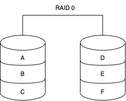
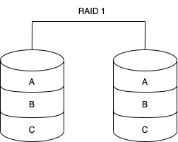
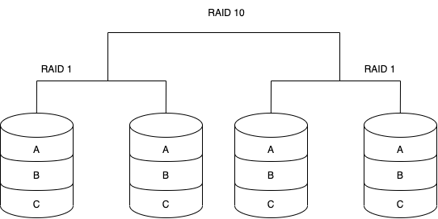
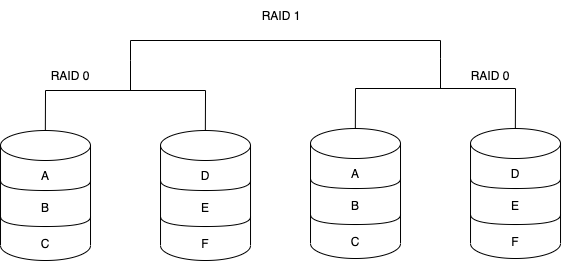
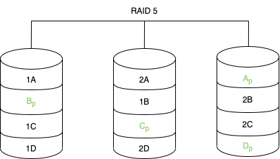

# Redundant Array of Independent Disks (RAID)

> Ein RAID-System dient zur Organisation mehrerer physischer Massenspeicher zu einem logischen
> Laufwerk, das eine höhere Ausfallsicherheit oder einen größeren Datendurchsatz erlaubt als ein
> einzelnes physisches Speichermedium.

## Allgemeines

* Logisches Laufwerk wird als *Logical Unit Number* (`LUN`) bezeichnet

## Verschiedene RAID Arten

### RAID 0 - Festplatten Striping

* Alle Daten werden einfach auf die verschiedenen Festplatten verteilt
* Nur geeignet für unkritische Anwendungen
* Vorteile
    - Hat eine hohe Leistung, da sich die Last auf die verschiedenen Festplatten verteilt
    - Niedrigste Kosten
    - Einfach implementierbar
* Nachteile
    - Verwendet keine Parität[^1]. Somit ist keine Datenredundanz oder Fehlertoleranz verfügbar.

### RAID 1 - Disk Mirroring

* Für dieses RAID werden mindestens zwei Festplatten benötigt
* Alle Daten werden immer auf zwei seperate physische Festplatten geschrieben. Somit ist eine
  Festplatte immer das Spiegelbild der anderen Festplatte.
* Geeignet für kritische Anwendungen

| Vorteile                                  | Nachteile                                                                  |
| -                                                                           | -                                                                                                          |
| Bietet sofortiges Failover, da sofort auf das Abbild geschwenkt werden kann | Schreibgeschwindigkeiten sind langsamer, da die Daten immer auf zwei Festplatten geschrieben werden müssen |
|                                                                             | Es wird immer der doppelte Speicherplatz benötigt                                                          |

### RAID 1+0 / RAID 10 - Plattenspiegelung und Striping

- Für dieses RAID werden mindestens 4 Festplatten benötigt
- Daten werden zuerst gespiegelt und dann gestriped
- Geeignet für Dienste, die eine geringe Ausfallsicherheit benötigen

| Vorteile                                                                          | Nachteile                                                            |
| -                                                                                                                   | -                                                                                                    |
| Profitiert von der Leistung von `RAID 0`, da mehrere Schreibköpfe gleichzeitig auf Teile der Daten zugreifen können | Wenn ein Laufwerk verloren geht, muss auf das andere Stripe-Set zugegriffen werden                   |
| Durch das `RAID 1` sind die Daten jedoch auch geschützt                                                             | Die Speicherkapazität wird auch hier verdoppelt. D.h. diese Variante ist teurer als andere Varianten |

### RAID 0+1 / RAID 01 - Striping und Plattenspiegelung

### RAID 2 - Striping und Hamming-Code-Parität

* Die Hardware bekommt nicht mit, wenn eine Festplatte defekt ist
* Die verlorenen Daten werden durch den RAID-Controller wiederhergestellt
* Wird nicht mehr so eingesetzt, da Hamming-Codes bereits in `Error Correction Codes von Festplatten
  verwendet wird

| Vorteile | Nachteile |
| -                                          | -                                         |
| Datensicherheit                            | Wesentlich komplexer                      |

### RAID 3 - Paritätsfestplatte

* Für dieses RAID werden mindestens drei Festplatten benötigt
* Speichert die Paritätsinformationen auf einer seperaten Festplatte, getrennt von den Daten
* Eignet sich gut für lange, sequentielle Datenübertragungen

| Vorteile | Nachteile                                                            |
| -                                          | -                                                                                                    |
| hoher Durchsatz: gut für große Datenmengen | zusätzliches Laufwerk für Parität: Leistung schlecht, wenn viele kleine Datenanforderungen vorliegen |

### RAID 4 - Paritätsfestplatte und Block-Level-Striping

* Wird kaum mehr verwendet

### RAID 5 - Festplatten Striping mit Parität

* Für dieses RAID werden mindestens drei Festplatten benötigt
* Daten werden wie bei RAID 0 verteilt
* Die Paritätsinformationen werden wie die Daten auch auf den Festplatten verteilt
* Gängigste RAID-Methode

| Vorteile                                                                    | Nachteile                                                 |
| -                                                                                                             | -                                                                                         |
| Guter Durchsatz und Leistung entsprechend zu RAID 0                                                           | Schreibleistung ist aufgrund der Paritätsdatenberechnungen langsamer als die Leseleistung |
| Da Paritätsdaten query über alle Festplatten gespeichert sind, ist dieser Typ einer der sichersten RAID-Typen | Längere Wiederherstellungszeiten                                                          |
| Festplatten können im laufenden Betrieb ausgetauscht werden. Dadurch werden Ausfallzeiten minimiert           | Möglicher Datenverlust, wenn ein zweites Laufwerk ausfällt                                |
|                                                                                                               | Anspruchsvollerer RAID-Controller notwendig                                               |

[^1]: Technik die prüft, ob Daten verloren gegangen sind oder überschrieben wurden, wenn sie von
einem Speicherort zum Anderen bewegt werden oder zwischen Computern übertragen werden.
