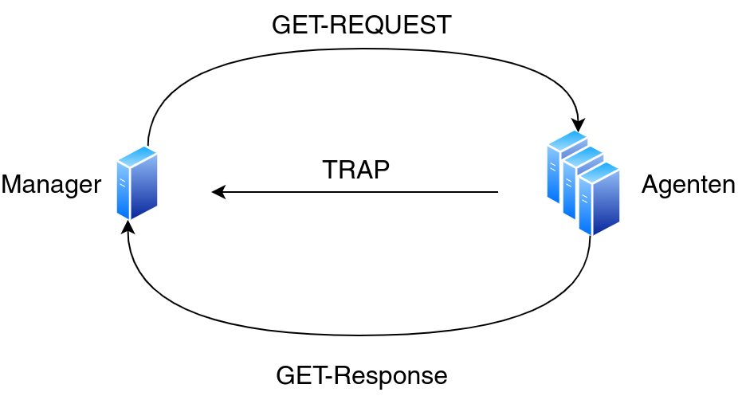

# SNMP (Simple Network Management Protocol)

* Auf der Anwendungsschicht angesiedelt
* Dient zur Überwachung und Steuerung von Netzwerkgeräten (z.B. Router, Switches, Firewalls, ...)
* Ports: 161/UDP für Abfrage der Agenten und 162/UDP für Traps

## Agent
* Läuft auf der zu überwachenden/steuernden Maschine
* Kann dort Systemzustände erfassen, Einstellungen vornehmen und Aktionen auslösen
* Beispiel: [snmpd](http://www.net-snmp.org/wiki/index.php/Snmpd)
* `sudo apt install snmpd`

## Manager
* Gegenkomponente zum `Agent`: Hier werden die Befehle zur Abfrage der Daten abgesendet, oder auch
  für die Ausführung von Aktionen
* `sudo apt install snmp`

| Datenpaket        | Beschreibung                                                                               | Tool                                  |
| -                 | -                                                                                          | -                                     |
| `GET-REQUEST`     | Anforderung eines spezifischen Datensatzes mit Hilfe einer eindeutigen `OID`               | `snmpget`                             |
| `GETNEXT-REQUEST` | Durchläuft auch die nachfolgenden Datensätze                                               | `snmpgetnext`                         |
| `GETBULK`         | Angegebene Anzahl an Datensätze auf einmal abrufen (ähnlich zu mehreren `GETNEXT-REQUEST`) | `snmpwalk`                            |
| `SET-REQUEST`     | Verändern von einem oder mehreren Datensätzen                                              | `snmpset`                             |
| `GET-RESPONSE`    | Empfängt die Antwort auf ein zuvor gesendetes Paket                                        | `snmpstatus`                          |
| `TRAP`            | Unaufgeforderte Nachricht bei Auftritt eines Ereignisses. Agent -> Manager                 | `snmptrapd` Läuft auf Manager 162/UDP |

## Object Identifier (OID)
* Eindeutige Bezeichnung für Objekte
* Stellt einen Knoten in einer Hierachie dar
* Ein Knoten besteht aus einer Folge von aneinandergeketteten Zahlen. Diese sind durch einen `.`
  getrennt
* Desto länger die Kette, desto genauer/spezifischer die Information
* Viele Knoten besitzen gar keine Informationen, sondern verweisen nur auf darunterliegende Knoten
* Darstellungsarten: `ASN.1` (wird auch in `MIB`'s verwendet), `URN`

## Management Information Base (MIB)
* Geben Auskunft, wo welche Informationen zu finden sind und wie sie formatiert sind
* Wird in Spezifikationssprache `ASN.1`[^1] verfasst

## Versionen
### SNMPv2
* Nicht verschlüsselt
* Authentifizierung: Community-String

### SNMPv3
* Verschlüsselt
* Authentifizierung über Username und Passwort
* Aus oben genannten Gründen soll `SNMPv3` `SNMPv2` bevorzugt werden

[^1]: Abstract Syntax Notation One - Beschreibungssprache zur Definition von Datenstrukturen für
      ein einheitliches Format
