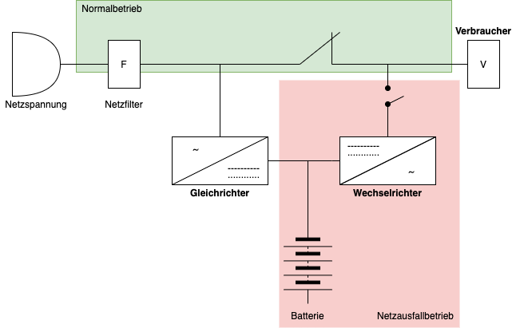
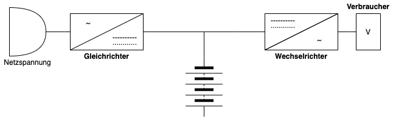

# USV

## Voltage and Frequency Dependent (VFD) Offline-USV

* Auch `Standby-` oder `Offline-USV` genannt
* Schützt nur vor totalem Netzausfall. Stromschwankungen können nicht ausgeglichen werden
* Bei Ausfall übernimmt ein Akku die Versorgung
* *Schaltzeiten*: Innerhalb weniger Millisekunden
* Aufladen des Akkus erfolgt im Normalbetrieb über den sogenannten `Ladegleichrichter`
* Wirkungsgrad: 95%
* Wird meist bei Kleinst-Verbrauchern oder nur für einzelne Computer eingesetzt

## Voltage Independent (VI) Line Interactive-USV

 Online-USV

* Auch `Dauerwandler-USV` genannt
* Bietet maximalen Schutz
* Gleicht Schwankungen der Spannung und auch der Netzfrequenz aus
* Verbraucher wird im `Normalbetrieb` dauerhaft über Akku versorgt. Daher braucht es auch keine
  Schaltzeiten bei einem Ausfall
* Arbeitet mit einem `Dauerwandlerprinzip`[^2]
* Durch das ständige Wandeln der Spannung entsteht Verlust und Wärme. Dadurch ist auch der
  Wirkungsgrad gering und liegt bei 90%
* Akku steht unter Dauerbelastung: Aus diesem Grund hält er im Schnitt zur drei bis vier Jahre
* Wird oft in der Server- und Datenkommunikation genutzt

[^1]: Telekommunikations-Anlagen
[^2]: Wandlung von Wechsel- in Gleichspannung und von Gleich- in Wechselspannung
