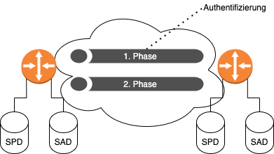

# Virtual Private Network (VPN)
## Vergleich der möglichen Datenleitungen

* Zuvor und auch sehr selten heute noch: `Leased Lines`[^1]
    * Teuer
    * Für Mobilarbeiter nicht möglich, da die Leitung ja fest verlegt ist
    * Skaliert nicht
* Normaler Anschluss
    * Günstig
    * Jedoch kann jeder auf dem Weg des Pakets mitlesen (`Vertraulichkeit` nicht vorhanden)
    * Um `Vertraulichkeit` wieder herzustellen kann ein VPN eingesetzt werden

## Allgemeines

* Findet in den meisten Fällen auf `Layer-3` statt (`MPLS`, `GRE`, `IPsec`)

## Typen von VPN
### Site-to-Site

* Dient zur Verbindung zwischen zwei Netzwerken

## End-to-Site (Remote-Access)

* Dient zur Anbindung von z.B. mobilen Arbeitern
* Der Client wird Teil des anderen Netzes

## IPsec

* Sichert `Vertraulichkeit`, `Integrität` und `Authentizität` ab
* Sammlung von Algorithmen und Funktionen

| Ziel                 | Realisierung          |
| -                    | -                     |
| `Vertraulichkeit`    | Verschlüsselung       |
| `Integrität`         | Hash-Funktionen       |
| `Authentizität`      | Identitätsüberprüfung |
| `Schlüsselaustausch` | Diffie-Hellman        |

| Realisierung       | Konkrete Methode    |
| Verschlüsselung    | DES, 3DES, AES      |
| Prüfsummen         | MD5, SHA            |
| Authentifizierung  | RSA, Pre-Shared-Key |
| Schlüsselaustausch | DH1, DH2, DH5, …    |

* Man spricht von einer `Security Association` (SA), wenn die Parameter für eine VPN-Verbindung
  ausgehandelt werden.

### Security Policy Database (SPD)

* Grundlage für die Entscheidung, wie mit einem Paket verfahren werden soll
* BYPASS, DISCARD,
  PROTECT

### Security Association Database (SAD)

* Enhält für jede aufgebaute `IPsec`-Verbindung einen Eintrag `SA`
* Bestandteile eines Eintrags (unvollständig):
    * Security Parameter Index: Welches Set an Parametern wird genutzt?
    * Sequenznummer: Sequenznummer des letzten Pakets -> Schützt vor Angriffen von außen
    * Modus: Tunnel- oder Transportmodus?
        * Tunnel: Mehr Informationen werden verschleiert. IP Paket wird in noch ein Paket eingepackt
        * Transportmodus: Nur der Nutzdatenanteil wird verschlüsselt. Wer kommuniziert ist also für
          alle einsehbar

### Internet Key Exchange (IKE)

* Aushandlung von Sicherheitsparametern für `IPsec`
* UDP Port 500
* Zwei Phasen
    1. `SA` für Steuerung: Verschlüsselte Verbindung wird aufgebaut, ist aber nur für die Steuerung
       gedacht
    2. 2x `SA` für Daten: Jeweils eine verschlüsselte Verbindung von einem Gateway zum Anderen
* Phasen werden immer wieder erneut aufgebaut, um Brute-Force fast unmöglich zu machen

### IPsec-Protokolle
#### Authentication Header (AH)

* Port 51
* Sichert `Authentizität` und `Integrität` ab
* Datenverkehr wird also nicht verschlüsselt

#### Encapsulation Security Protocol (ESP)

* Port 50
* Sichert `Vertraulichkeit`, `Authentizität` und `Integrität` ab

[^1]: Leased Lines sind sind nur für ein Unternehmen reserviert und verbinden zwei Orte miteinander.
